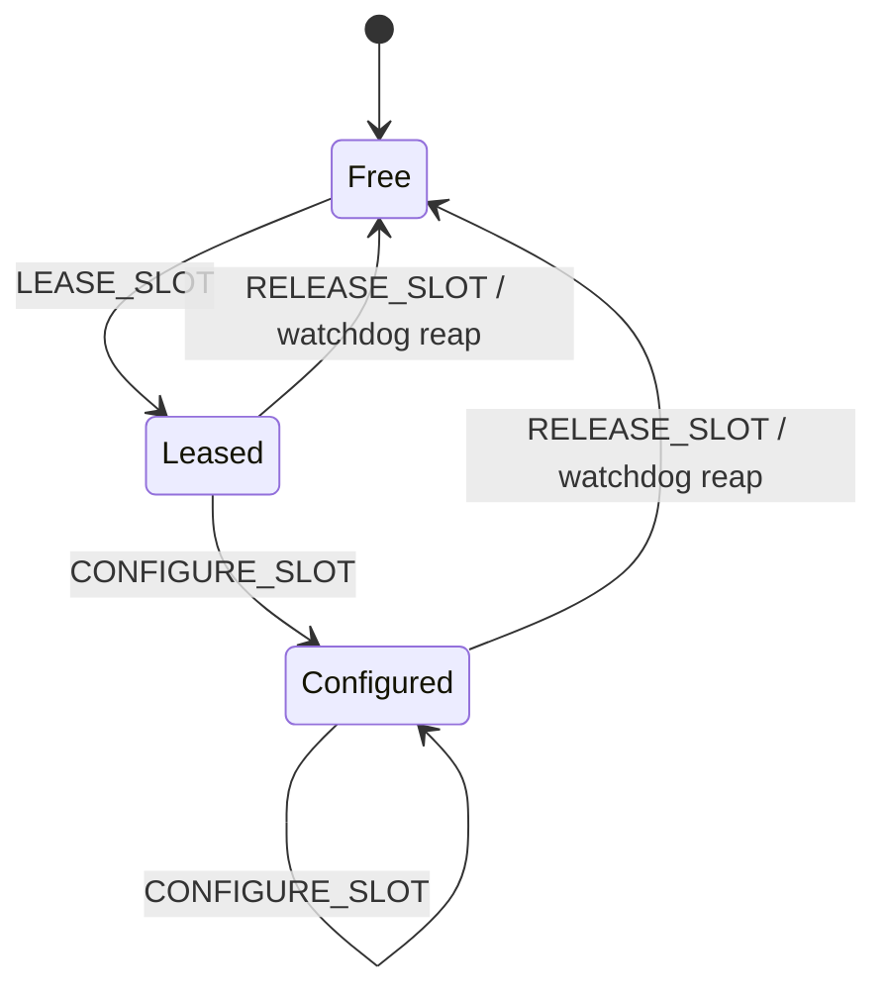

# Jochona Display Adapter protocol v1.0

Canonical definitions live in [`include/jochona/display_adapter_abi.h`](../include/jochona/display_adapter_abi.h)
(portable, no Windows dependency) and
[`include/jochona/display_adapter_guid.h`](../include/jochona/display_adapter_guid.h)
(Windows `GUID`/`DEFINE_GUID` companion). This document is a human-readable
summary; the header is authoritative on any conflict.

## Identity

- Device interface GUID: `b98f1cbd-eaec-5d98-82ab-e899d2643fa1`
- Protocol version: **1.0** (`JOCHONA_DISPLAY_ADAPTER_PROTOCOL_VERSION_MAJOR=1`,
  `..._MINOR=0`)
- Default slot pool capacity: **1** (`JOCHONA_PROTOCOL_V1_MAX_SLOTS`). The
  one slot's id is always `0` and its identity (container id, EDID) is
  stable across Host restarts.

Jochona Host may duplicate `display_adapter_abi.h` verbatim into its own
tree, with provenance, per the repository-boundary contract — Host has no
compile-time or link-time dependency on this repository.

## Transport

All eight IOCTLs are `METHOD_BUFFERED`, dispatched through
`EvtIddCxDeviceIoControl` (see
`driver/JochonaDisplayAdapter/IoControl.cpp`). The device object's SDDL
(`driver/JochonaDisplayAdapter/Acl.cpp`) restricts open access to
`SYSTEM` and members of the local `Administrators` group; callers outside
those principals cannot open a handle to the device at all, so IOCTL
access bits themselves are `FILE_ANY_ACCESS`.

## IOCTLs

| IOCTL | Input | Output | Notes |
|---|---|---|---|
| `IOCTL_JOCHONA_GET_PROTOCOL_VERSION` | none | `JochonaGetProtocolVersionOut` | Version handshake; always succeeds if the output buffer is large enough. |
| `IOCTL_JOCHONA_ENUMERATE_SLOTS` | `JochonaEnumerateSlotsIn` | `JochonaEnumerateSlotsOut` | Lists every slot (v1.0: exactly slot 0) with its current state/owner/mode. |
| `IOCTL_JOCHONA_LEASE_SLOT` | `JochonaLeaseSlotIn` | `JochonaLeaseSlotOut` | Free → Leased. Caller supplies an opaque `OwnerId`; driver returns an opaque `LeaseToken`. |
| `IOCTL_JOCHONA_CONFIGURE_SLOT` | `JochonaConfigureSlotIn` | none | Leased/Configured → Configured with the new `JochonaSlotMode`. Requires the exact `LeaseToken` from `LEASE_SLOT`. Pushes the mode to the OS via `IddCxMonitorUpdateModes(2)` before completing. |
| `IOCTL_JOCHONA_RELEASE_SLOT` | `JochonaReleaseSlotIn` | none | Leased/Configured → Free. Restores the slot's baseline mode (1920x1080@60, 8bpc, SDR) and pushes it to the OS. |
| `IOCTL_JOCHONA_SET_RENDER_ADAPTER_LUID` | `JochonaSetRenderAdapterLuidIn` | none | Pins the IddCx adapter's render adapter via `IddCxAdapterSetRenderAdapter`; not slot-scoped. |
| `IOCTL_JOCHONA_GET_WATCHDOG` | `JochonaGetWatchdogIn` | `JochonaGetWatchdogOut` | Reports the watchdog timeout and elapsed time since the slot's last ping. |
| `IOCTL_JOCHONA_WATCHDOG_PING` | `JochonaWatchdogPingIn` | none | Resets the slot's orphan timer. Requires the exact `LeaseToken`. |

## State machine

Implemented in `src/protocol/SlotStateMachine.{h,cpp}` — portable,
WDF-free, and exercised directly by `tests/JochonaProtocolTests`. The
driver (`driver/JochonaDisplayAdapter`) links these files unmodified.

A WDF periodic timer (`driver/JochonaDisplayAdapter/Driver.cpp`,
`EvtJochonaWatchdogTimer`) calls `SlotStateMachine::ReapOrphans()` every
second; any lease silent longer than the watchdog timeout
(`kDefaultWatchdogTimeoutMs`, 5000 ms) is force-released and its mode
restored, exactly as `RELEASE_SLOT` would.

## Status mapping

`jochona::protocol::Dispatch` returns an in-process `JochonaStatus`. The
WDF boundary (`driver/JochonaDisplayAdapter/IoControl.cpp`,
`JochonaStatusToNtStatus`) maps it to the `NTSTATUS` surfaced through
`DeviceIoControl()`/`GetLastError()`:

| `JochonaStatus` | `NTSTATUS` |
|---|---|
| `JOCHONA_STATUS_SUCCESS` | `STATUS_SUCCESS` |
| `JOCHONA_STATUS_UNKNOWN_IOCTL` | `STATUS_INVALID_DEVICE_REQUEST` |
| `JOCHONA_STATUS_BUFFER_TOO_SMALL` | `STATUS_BUFFER_TOO_SMALL` |
| `JOCHONA_STATUS_PROTOCOL_VERSION_MISMATCH` | `STATUS_REVISION_MISMATCH` |
| `JOCHONA_STATUS_SLOT_NOT_FOUND` | `STATUS_NOT_FOUND` |
| `JOCHONA_STATUS_SLOT_BUSY` | `STATUS_DEVICE_BUSY` |
| `JOCHONA_STATUS_SLOT_NOT_LEASED` | `STATUS_INVALID_DEVICE_STATE` |
| `JOCHONA_STATUS_LEASE_TOKEN_MISMATCH` | `STATUS_ACCESS_DENIED` |
| `JOCHONA_STATUS_INVALID_PARAMETER` | `STATUS_INVALID_PARAMETER` |

Keep this table, `JochonaStatusToNtStatus`, and any Host-side copy in
sync — it is the only place status codes are translated across the
driver/Host process boundary.

## What replaced the upstream XML/PnP-toggle control surface

The pre-fork driver (`legacy/upstream-vdd`) controlled runtime behavior
through `vdd_settings.xml`, a registry path lookup, and a named pipe
(`toggle-VDD.ps1` and friends), all requiring PnP device churn
(uninstall/reinstall or a `RELOAD_DRIVER` cycle) to apply most changes.
Jochona Display Adapter replaces all of that with the IOCTL protocol
above: one long-lived monitor object, mode changes applied in place via
`IddCxMonitorUpdateModes(2)`, and no on-disk configuration file at all.
